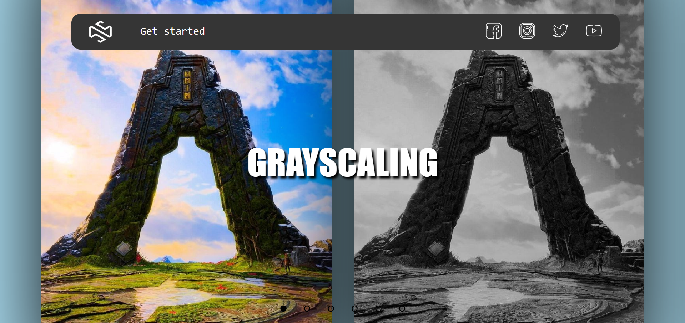
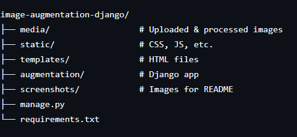

# 🖼️ Image Augmentation Web App (Django)

This is a full-stack web application built using **Django** that allows users to perform various **image augmentation techniques** through a clean and responsive interface. The app is designed to help researchers and data scientists easily expand their image datasets, especially for medical imaging and classification tasks.



---

## 🔧 Features

- Upload images through an intuitive web UI
- Apply augmentation techniques:
  - Rotation (90°, 180°, 270°)
  - Horizontal Flip
  - Vertical Flip
  - Grayscale
- Download augmented images as a ZIP
- Preview augmentations in real-time
- Secure file handling and organized file storage

---

## 💡 Use Case

This tool was used in a breast cancer classification project to augment **microscopic pathology images**. The generated images were later used to train deep learning models including:
- MobileNetV2
- DenseNet121
- InceptionV3

> Certain transformations like cropping or random zoom were avoided to preserve critical cellular features in pathology slides.

---

## 🖼️ Screenshots

| Original Upload Page | Augmentation Options | Augmented Preview |
|----------------------|----------------------|-------------------|
|  |  |  |

---

## 🚀 Getting Started

### 1. Clone the Repository
```bash
git clone https://github.com/yourusername/image-augmentation-django.git
cd image-augmentation-django
```

---

### 2. Create & Activate Virtual Environment

python -m venv venv
source venv/bin/activate  # Linux/macOS
venv\Scripts\activate     # Windows

---

## 📚 Directory Structure



---

## 🧠 Tech Stack

* Backend: Django
* Frontend: HTML, CSS, Bootstrap
* Image Processing: Pillow
* Deployment (optional): Render / Heroku / PythonAnywhere

## 📜 License

This project is licensed under the MIT License. Feel free to use and modify it for your own dataset needs.

## 🙌 Acknowledgements

Special thanks to my team members and our guide who worked hard with me to develop this project.
